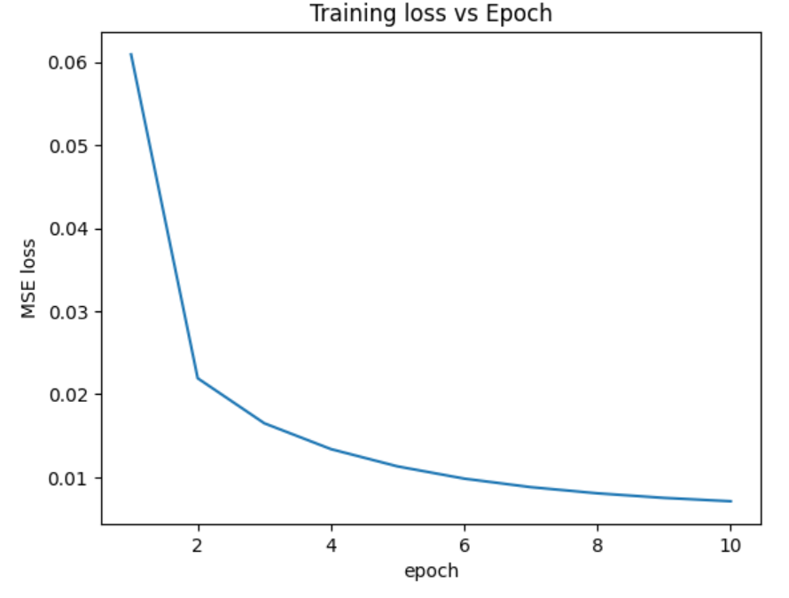
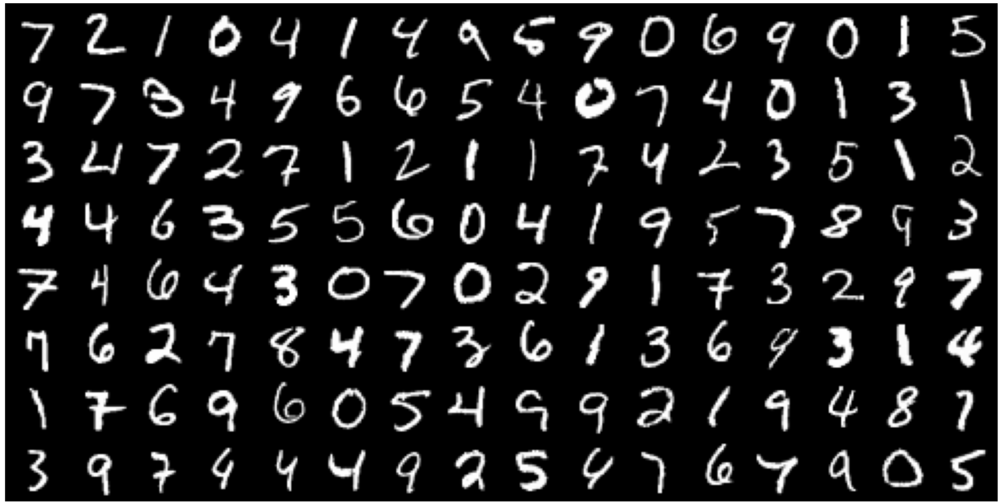
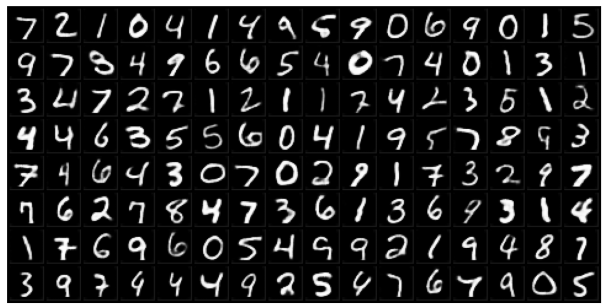
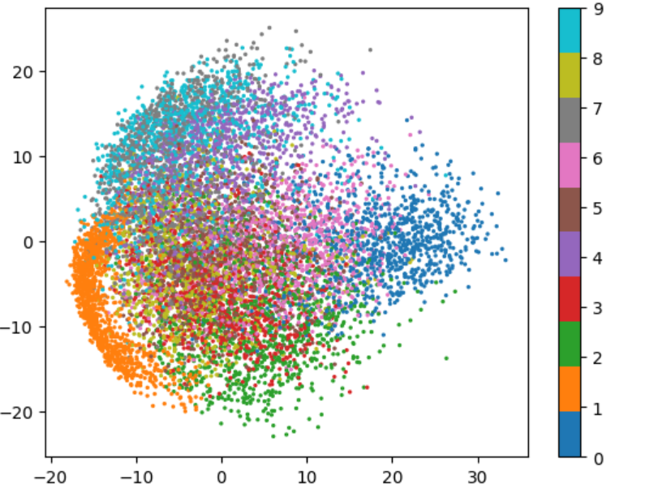
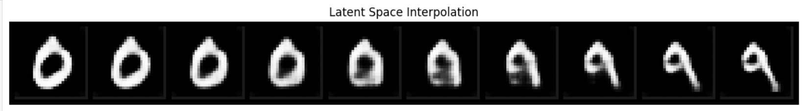

# Convolutional Autoencoder (PyTorch)

## Overview

This project implements a convolutional autoencoder using **PyTorch** to learn compressed representations of images from the **MNIST** dataset.

Autoencoders are unsupervised neural networks that learn to compress input data into a lower-dimensional **latent representation** and reconstruct the original input from that representation.

The goal of this project is to explore representation learning and analyze the structure of the learned latent space.

---

## Architecture

The autoencoder consists of two main components:

### Encoder

The encoder compresses the input image into a low-dimensional latent vector.

```
Input (1×28×28)
↓
Conv2D (1 → 16)
↓
ReLU
↓
MaxPool
↓
Conv2D (16 → 32)
↓
ReLU
↓
MaxPool
↓
Flatten
↓
Linear → Latent Vector
```

### Decoder

The decoder reconstructs the image from the latent representation.

```
Latent Vector
↓
Linear
↓
Unflatten
↓
ConvTranspose2D
↓
ReLU
↓
ConvTranspose2D
↓
Sigmoid
↓
Reconstructed Image
```
---

## Experiments

Several experiments were conducted to analyze the learned representations.

### 1. Reconstruction Training

The autoencoder was trained to minimize reconstruction loss between the original image and its reconstruction.

Loss function: Mean Squared Error (MSE)

The plot below shows the training loss per epoch for an autoencoder with a latent dimension of **32**.



---

### 2. Reconstruction Visualization

Reconstructed digits were compared to original digits to visually evaluate model performance.

The model successfully reconstructs most digits while maintaining key visual features.

Original MNIST images:



Reconstructed MNIST images:



---

### 3. Latent Dimension Comparison

Different latent sizes were tested to analyze the compression tradeoff.

| Latent Dimension | Reconstruction Quality | Compression       |
| ---------------- | ---------------------- | ----------------- |
| 8, 16                | blurry digits          | high compression  |
| 32               | moderate quality       | balanced          |
| 64, 128               | clear reconstructions  | lower compression |

Increasing the latent dimension improves reconstruction quality but reduces compression.

---

### 4. Latent Space Visualization

Principal Component Analysis (PCA) was applied to the latent vectors to visualize their structure.

Even though the model was trained without labels, the latent representation shows partial clustering of digit classes, indicating that the encoder captures meaningful visual features.

The PCA plot below shows the latent vectors from the test set projected into *2 dimensions*.



---

### 5. Latent Space Interpolation

Two digits were encoded and interpolated within the latent space.

Decoding intermediate vectors produces smooth transitions between digits, demonstrating that the learned representation is continuous.

The visualization below shows interpolation between the latent representations of the digits **0 and 9**.



---

## Key Learnings

This project explores several core deep learning concepts:

* Convolutional neural networks
* Encoder–decoder architectures
* Unsupervised representation learning
* Latent space analysis
* Dimensionality reduction with PCA

These experiments demonstrate how autoencoders can learn meaningful representations without supervision and reveal structure within high-dimensional image data.

---

## Technologies Used

* PyTorch
* Python
* NumPy
* Matplotlib
* scikit-learn

---

## Project Structure

```
cnn-autoencoder
│
├── autoencoder.py
├── autoencoder_experiments.ipynb
├── images
└── README.md
```
